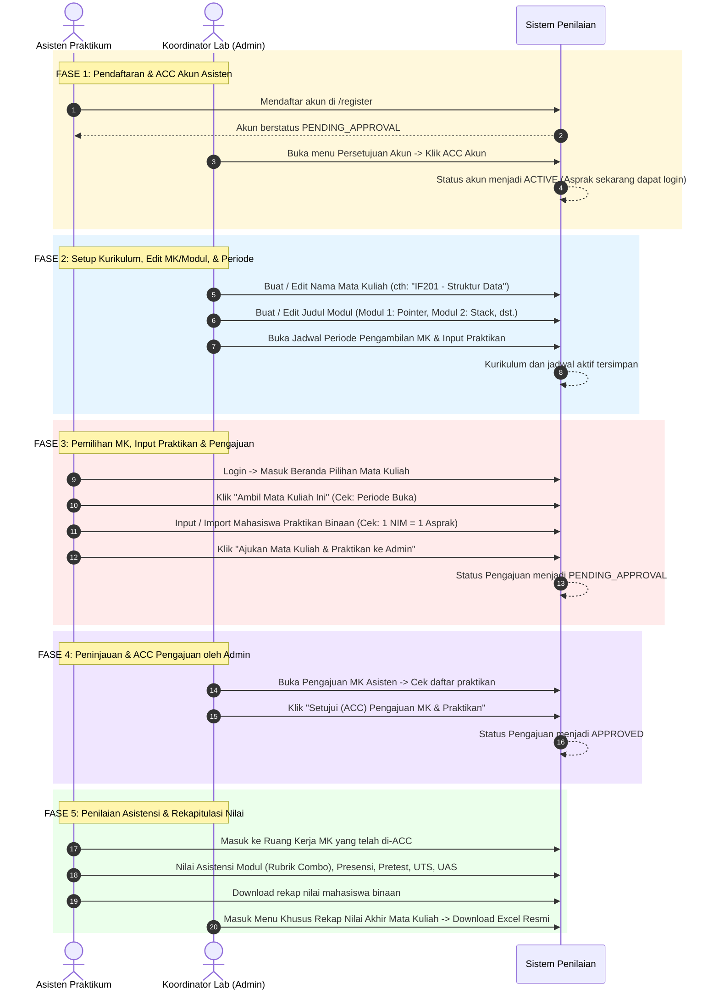

# Product Requirements Document (PRD)
# Sistem Penilaian Asistensi Praktikum Laboratorium

| Metadata | Detail |
| :--- | :--- |
| **Status** | Updated / Ready for Implementation |
| **Versi Dokumen** | **1.3.0 (Course-Centric Navigation, Proposal & ACC Workflow, Multi-Period Control)** |
| **Terakhir Diperbarui** | 2026-09-05 |
| **Stack Utama** | Next.js (App Router), PostgreSQL, Prisma ORM, MinIO (S3-Compatible), Tailwind CSS |
| **Tema Desain** | Neubrutalism (Border 3px hitam solid, offset shadow 4px, font monospaced angka) |

---

## 1. Ringkasan Proyek (Overview & Objective)

Sistem Penilaian Asistensi Laboratorium adalah **platform web internal terpadu** bagi Asisten Praktikum (Asprak) dan Koordinator Laboratorium (Admin) untuk menyelenggarakan, menilai, mengarsipkan tugas, dan merekap nilai praktikum secara cepat, transparan, dan akurat. Mahasiswa praktikan tidak memiliki akun login ke sistem ini.

Pada Versi 1.3.0, arsitektur operasional laboratorium disempurnakan menjadi **Course-Centric (Berpusat pada Mata Kuliah)** dengan sistem verifikasi berjenjang (*Double Approval Workflow*):
1. **Navigasi Beranda Berpusat pada Mata Kuliah (Course-Centric Landing):**
   - **Beranda Asprak:** Begitu login, Asprak langsung diarahkan ke katalog/pilihan mata kuliah praktikum untuk melihat status pengajuan dan memilih mata kuliah yang hendak diampu. Penilaian asistensi hanya dapat diakses setelah memilih mata kuliah yang telah disetujui.
   - **Beranda Admin:** Begitu login, Admin langsung disajikan daftar seluruh mata kuliah praktikum aktif beserta ringkasan asisten, jumlah modul, dan rekapitulasi nilai per mata kuliah.
   - **Peniadaan Menu Modul Global Statis:** Menu modul statis global lama dihilangkan karena seluruh susunan modul bersifat dinamis per mata kuliah di dalam ruang kerja mata kuliah (`/[courseId]/...`).
2. **Fleksibilitas Kurikulum Admin (CRUD Mata Kuliah & Modul):**
   - Admin dapat membuat mata kuliah praktikum dan modul-modulnya.
   - **Admin dapat mengedit nama mata kuliah serta judul dan deskripsi setiap modul.**
3. **Kontrol Periode Mandiri (Dual Period Windows):**
   - Admin dapat membuka dan menutup:
     - **Periode Pengambilan/Klaim Mata Kuliah oleh Asprak** (`courseClaimStart` s.d. `courseClaimEnd` / `courseInputStart` s.d. `courseInputEnd`).
     - **Periode Input & Import Mahasiswa Praktikan** (`studentInputStart` s.d. `studentInputEnd`).
4. **Alur Pengajuan & Persetujuan (Proposal & ACC Workflow):**
   - Asprak memilih mata kuliah yang ingin diampu dan mengisi daftar mahasiswa binaannya (hanya saat periode buka).
   - Asprak mengajukan (*Submit Proposal*) nama mata kuliah dan daftar praktikan tersebut kepada Admin.
   - **Admin melakukan peninjauan dan ACC (Approval):**
     - Sebelum di-ACC, status mata kuliah berstatus `PENDING_REVIEW` dan Asprak belum diizinkan melakukan penilaian.
     - Setelah di-ACC oleh Admin, status menjadi `APPROVED`, dan Asprak mendapatkan akses penuh ke ruang kerja penilaian asistensi modul.
5. **Penetapan Praktikan Langsung oleh Admin (Admin Direct Assignment):**
   - Admin memiliki wewenang memasukkan data mahasiswa praktikan secara langsung ke suatu mata kuliah sekaligus menetapkan asisten praktikum yang mengampunya.
6. **Menu Khusus Rekap Nilai Akhir Berdasarkan Mata Kuliah:**
   - Admin memiliki halaman dashboard khusus untuk meninjau rekapitulasi nilai akhir semester seluruh mahasiswa per mata kuliah secara komprehensif, membandingkan performa kelas antar-asisten, dan mengunduh berkas Excel resmi untuk Dosen Pengampu.
7. **Aturan Integritas Praktikan Tunggal (Strict Single-Assistant Rule):**
   - Dalam satu mata kuliah yang sama, **1 NIM mahasiswa praktikan hanya boleh dibimbing oleh 1 asisten praktikum**.
8. **Keamanan Ketat (Authentication & Authorization):**
   - Seluruh endpoint Server Action, Route Handler, dan Page Component dilindungi guard sesi dan otorisasi berbasis peran (RBAC).

---

## 2. Aktor, Peran, & Hak Akses (RBAC)

```
[SISTEM PENILAIAN ASISTENSI]
 ├── 1. Koordinator / Admin Laboratorium (ADMIN)
 │    ├── Beranda: Katalog & Pengelolaan Seluruh Mata Kuliah
 │    ├── Menyetujui / Menolak (ACC) Pendaftaran Akun Asprak Baru
 │    ├── Mengatur Jadwal Buka/Tutup:
 │    │    ├── Periode Pengambilan / Klaim Mata Kuliah oleh Asprak
 │    │    └── Periode Input & Import Praktikan
 │    ├── Membuat & Mengedit Mata Kuliah (Kode MK, Nama MK)
 │    ├── Menambah & Mengedit Judul serta Detail Modul Praktikum
 │    ├── Menyetujui (ACC) Pengajuan Mata Kuliah & Praktikan dari Asprak
 │    ├── Memasukkan Praktikan secara langsung & Menetapkan Nama Aspraknya
 │    ├── Menu Khusus: Rekap Nilai Akhir Seluruh Praktikan per Mata Kuliah
 │    └── Ekspor Rekapitulasi Nilai Resmi ke Excel (.xlsx) untuk Dosen Pengampu
 └── 2. Asisten Praktikum (ASISTEN)
      ├── Registrasi Akun di /register (Menunggu ACC Admin)
      ├── Beranda: Daftar Pilihan Mata Kuliah & Status Persetujuan Pengajuan
      ├── Mengambil Mata Kuliah (Hanya saat periode buka)
      ├── Mengisi / Mengimpor Praktikan Binaan (Hanya saat periode buka)
      │    └── Validasi Integritas: 1 NIM hanya punya 1 Asprak di 1 MK
      ├── Mengajukan (Submit) Pilihan MK & Daftar Praktikan ke Admin
      ├── Menilai Asistensi Modul (Hanya setelah Pengajuan di-ACC Admin)
      ├── Mengisi Presensi Pertemuan (12x), Pretest, dan Nilai Ujian (UTS/UAS)
      └── Mengunduh Rekapitulasi Nilai Binaan ke Excel (.xlsx)
```

### Matriks Peran & Izin (Access Control Matrix)

| Fitur / Aksi | Asisten Praktikum (ASISTEN) | Koordinator Lab (ADMIN) |
| :--- | :---: | :---: |
| **Registrasi Akun Baru** | Mengajukan (Status `PENDING`) | - |
| **ACC / Persetujuan Akun Asprak** | ❌ Tidak Berhak | ✅ Penuh (ACC / Tolak / Nonaktifkan) |
| **Buka/Tutup Periode Klaim MK & Input Praktikan** | 👁️ Hanya Membaca Jadwal | ✅ Penuh (Atur Tanggal Buka & Tutup) |
| **Buat & Edit Nama Mata Kuliah** | ❌ Tidak Berhak | ✅ Penuh (Tambah & Edit Nama MK) |
| **Buat & Edit Judul Modul** | ❌ Tidak Berhak | ✅ Penuh (Tambah & Edit Judul Modul) |
| **Ambil / Klaim Mata Kuliah** | ✅ Mengajukan saat periode buka | ✅ Menetapkan Asprak ke MK secara langsung |
| **Input / Import Data Praktikan** | ✅ Input binaan sendiri saat periode buka | ✅ Input langsung & tentukan aspraknya |
| **Validasi 1 NIM = 1 Asprak per MK** | 🛡️ Ditolak otomatis jika bentrok | 🛡️ Ditolak otomatis (Integritas Data) |
| **Pengajuan MK & Praktikan (Submit Proposal)** | ✅ Mengajukan ke Admin | 👁️ Menerima daftar pengajuan |
| **ACC Pengajuan MK & Praktikan** | ❌ Tidak Berhak | ✅ Penuh (ACC / Kembalikan Pengajuan) |
| **Pembatalan Pengambilan MK** | ⚠️ Hanya sebelum di-ACC Admin & tanpa mahasiswa binaan | ✅ Penuh |
| **Penilaian Asistensi (Combo Rubrik)** | ✅ Diizinkan setelah pengajuan di-ACC | ✅ Seluruh Mahasiswa |
| **Input Presensi, Pretest, UTS/UAS** | ✅ Diizinkan setelah pengajuan di-ACC | ✅ Seluruh Mahasiswa |
| **Menu Rekap Nilai Akhir per Mata Kuliah** | 👁️ Khusus MK & praktikan binaan sendiri | ✅ Menu khusus seluruh praktikan per MK |
| **Export Excel Rekap Nilai Resmi** | ✅ Khusus format kelas binaan sendiri | ✅ Format gabungan resmi per MK untuk Dosen |

---

## 3. Alur Kerja Sistem (Business Workflow)



---

## 4. Rincian Fitur Utama

### 4.1. Beranda Berpusat pada Mata Kuliah (Course-Centric Landing)
* **Untuk Asprak (`/praktikum`):**
  * Halaman pertama setelah login langsung menampilkan **Katalog / Daftar Mata Kuliah**.
  * Setiap kartu mata kuliah menampilkan:
    * Kode & Nama Mata Kuliah, Jumlah Modul, dan Periode Akademik.
    * Status Pengajuan: `BELUM DIAMBIL`, `MENUNGGU ACC ADMIN` (Kuning), `DISETUJUI` (Hijau), atau `DITOLAK` (Merah).
    * Jika sudah disetujui (`APPROVED`), muncul tombol tebal **"Masuk Ruang Kerja Penilaian"** mengarah ke `/[courseId]/penilaian/...`.
    * Jika masih `MENUNGGU ACC`, tombol penilaian dinonaktifkan dengan tooltip informatif.
* **Untuk Admin (`/admin/matakuliah`):**
  * Halaman pertama setelah login langsung menampilkan **Daftar Seluruh Mata Kuliah Praktikum**.
  * Dilengkapi tombol:
    * **"+ Buat Mata Kuliah Baru"**
    * **"Edit Nama MK & Modul"** (bisa mengubah nama MK, kode MK, dan judul modul kapan saja).
    * **"Kelola Praktikan"** (memasukkan mahasiswa dan memilih asisten pengampunya).
    * **"Rekap Nilai Akhir"** (langsung membuka rekap nilai kumulatif MK tersebut).

### 4.2. Manajemen Modul & Edit Mata Kuliah oleh Admin
* Admin dapat mengedit detail mata kuliah yang sudah ada:
  * Mengubah Nama Mata Kuliah dan Kode Mata Kuliah.
  * Mengubah Judul Modul, Deskripsi Modul, dan Status Laporan Akhir.
  * Menambah modul baru atau mengatur urutan (*orderIndex*).

### 4.3. Alur Pengajuan Mata Kuliah & Praktikan oleh Asprak
* Di halaman mata kuliah yang diambil:
  1. Asprak mengimpor/menambah mahasiswa binaan selama periode input praktikan dibuka.
  2. Terdapat tombol konfirmasi **"Ajukan Mata Kuliah & Praktikan"**.
  3. Setelah diajukan, status berubah menjadi `PENDING_APPROVAL`.
  4. Admin menerima notifikasi pada panel admin untuk menyetujui (ACC) atau meminta revisi.
  5. Setelah Admin menekan tombol ACC, status menjadi `APPROVED` dan tombol penilaian asistensi modul aktif.

### 4.4. Penetapan Praktikan Langsung oleh Admin (Admin Direct Assignment)
* Pada panel Admin:
  * Admin dapat membuka menu praktikan per mata kuliah.
  * Admin dapat menambah mahasiswa tunggal atau mengimpor Excel.
  * Admin memiliki dropdown **"Pilih Asisten Pengampu"** untuk menentukan asprak yang membina mahasiswa tersebut secara langsung tanpa menunggu pengajuan asprak.

### 4.5. Menu Khusus Rekap Nilai Akhir per Mata Kuliah untuk Admin
* Admin memiliki menu khusus di `/admin/rekap-nilai` atau `/[courseId]/rekap-nilai`:
  * Dropdown pemilihan Mata Kuliah aktif.
  * Tabel komprehensif seluruh mahasiswa dari seluruh asisten yang mengampu mata kuliah tersebut.
  * Statistik rata-rata nilai per kelas/shift dan per modul.
  * Tombol **"Download Excel Resmi Dosen"** dengan format standar laboratorium.

### 4.6. Validasi Integritas NIM Tunggal (Strict Single-Assistant Rule)
* Dalam satu mata kuliah yang sama, **seorang mahasiswa (NIM) tidak boleh diampu oleh 2 asisten berbeda**.
* Jika NIM sudah tercatat di bawah asprak lain pada mata kuliah tersebut, proses tambah/import otomatis menolak dengan pesan:
  `"Mahasiswa dengan NIM [NIM] sudah terdaftar di bawah asisten [Nama Asprak Lain]. 1 NIM hanya boleh diampu oleh 1 asisten dalam mata kuliah ini."`

---

## 5. Struktur Rubrik Penilaian (Tetap Sesuai Formula Resmi)

Masing-masing modul praktikum dinilai menggunakan formula standar laboratorium:

### 5.1. Penilaian Per Modul (100 Poin Maksimal)
* **1. Asistensi Code (55%)**:
  - Kesesuaian Fitur Tugas: **22 poin**
  - Penjelasan & Penguasaan Program: **19 poin**
  - Kehadiran Asistensi: **8 poin**
  - Sikap & Komunikasi: **6 poin**
* **2. Laporan Resmi (35%)**:
  - Pembahasan & Analisis Hasil: **12 poin**
  - Kepatuhan Format Laporan: **10.5 poin**
  - Plagiarisme & Orisinalitas: **9 poin**
  - Kerapian Dokumen: **3.5 poin**
* **3. Ketepatan Pengumpulan (10%)**:
  - Waktu Pengumpulan: **10 poin**

### 5.2. Akumulasi Semester (Rekapitulasi 100%)
$$\text{Nilai Akhir} = (10\% \times \text{Kehadiran 12x}) + (20\% \times \text{Rata-rata Mod } N) + (10\% \times \text{Pretest}) + (25\% \times \text{UTS}) + (35\% \times \text{UAS})$$

Konversi Nilai Akhir menjadi Huruf Mutu resmi:
$$> 80 \rightarrow \mathbf{A} \quad|\quad (75, 80] \rightarrow \mathbf{B+} \quad|\quad (70, 75] \rightarrow \mathbf{B} \quad|\quad (65, 70] \rightarrow \mathbf{C+} \quad|\quad (60, 65] \rightarrow \mathbf{C} \quad|\quad [50, 60] \rightarrow \mathbf{D} \quad|\quad < 50 \rightarrow \mathbf{E}$$

---

## 6. Desain Antarmuka: Neubrutalism

Mengikuti token desain di [design.md](./design.md):
* **Borders & Shadows:** Border solid `3px solid #000000` dengan drop shadow tegas `4px 4px 0 #000000`.
* **Katalog Mata Kuliah untuk Asprak:**
  - Menampilkan kartu-kartu mata kuliah yang dibuat Admin.
  * Status Proposal Badge:
    - Hijau: `DISETUJUI (APPROVED)` $\rightarrow$ Tombol `Buka Ruang Kerja Penilaian`.
    - Kuning: `MENUNGGU ACC ADMIN` $\rightarrow$ Tombol disabled dengan pesan peninjauan.
    - Biru: `BELUM DIAMBIL` $\rightarrow$ Tombol `+ Ambil Mata Kuliah Ini`.
* **Admin Course Builder & Editor:**
  - Form pembuatan & pengeditan mata kuliah: Kode MK, Nama MK.
  - Dynamic Form Repeater: Tambah/edit baris modul (Judul Modul, Checkbox Laporan Akhir, Hapus modul).

---

## 7. Arsitektur Folder Fitur (Feature-First)

```
penilaian_asistensi/
├── app/
│   ├── (auth)/
│   │   ├── login/page.tsx               # Login Asprak & Admin
│   │   └── register/page.tsx            # Registrasi Calon Asprak (Pending Approval)
│   ├── (dashboard)/
│   │   ├── layout.tsx                   # Layout Shell, Navbar, Role Badge
│   │   ├── admin/                       # Panel Khusus Admin Lab
│   │   │   ├── matakuliah/              # Beranda Default Admin: List MK & Modul
│   │   │   │   ├── page.tsx             # List Seluruh MK, Modul, & Status Asprak
│   │   │   │   ├── baru/page.tsx        # Builder MK & Modul Baru
│   │   │   │   └── [courseId]/edit/page.tsx # Edit Nama MK & Judul Modul
│   │   │   ├── persetujuan-akun/page.tsx# Antrean ACC Akun Asprak Baru
│   │   │   ├── pengajuan-matakuliah/page.tsx # Antrean ACC Pengajuan MK & Praktikan dari Asprak
│   │   │   ├── periode/page.tsx         # Kelola Tanggal Buka/Tutup Klaim MK & Input Praktikan
│   │   │   └── rekap-nilai/page.tsx     # Menu Khusus Rekap Nilai Akhir Seluruh MK
│   │   ├── praktikum/                   # Beranda Default Asprak: Katalog Pilihan Mata Kuliah
│   │   │   └── page.tsx                 # List MK, Status Pengajuan (Pending/Approved), Tombol Klaim
│   │   ├── [courseId]/                  # Ruang Kerja Mata Kuliah Terpilih
│   │   │   ├── praktikan/page.tsx       # Manajemen Praktikan Binaan & Tombol Submit Pengajuan
│   │   │   ├── penilaian/[modId]/page.tsx # Spreadsheet Penilaian Combo Modul (Hanya jika Approved)
│   │   │   └── rekap-nilai/page.tsx     # Rekap Nilai MK terpilih
├── features/
│   ├── auth/                            # Login, Register, Status Akun
│   ├── admin/                           # ACC Akun, ACC Pengajuan MK, Kelola Periode, Kelola Admin CLI
│   ├── courses/                         # Master MK, Edit MK & Modul, Klaim MK, Proposal ACC
│   ├── students/                        # Import Mahasiswa, Single-Assistant per MK, Admin Direct Assignment
│   ├── grading/                         # Combo Rubric Evaluation Workspace (Protected by Approval)
│   └── final-grades/                    # Formula Semester & Export Excel .xlsx per Mata Kuliah
```

---

## 8. Rancangan Skema Basis Data Relasional (Prisma ORM)

```prisma
datasource db {
  provider = "postgresql"
}

generator client {
  provider = "prisma-client-js"
}

enum Role {
  ADMIN
  ASISTEN
}

enum UserStatus {
  PENDING_APPROVAL   // Baru mendaftar, menunggu persetujuan Admin
  ACTIVE             // Disetujui, dapat login dan beraktivitas
  REJECTED           // Ditolak oleh Admin
  SUSPENDED          // Dinonaktifkan sementara
}

enum ProposalStatus {
  DRAFT              // Sedang diisi oleh asprak
  PENDING_APPROVAL   // Diajukan oleh asprak, menunggu ACC Admin
  APPROVED           // Disetujui Admin, penilaian dibuka
  REJECTED           // Ditolak / diminta revisi oleh Admin
}

enum SubmissionStatus {
  NOT_SUBMITTED
  SUBMITTED
  GRADED
}

enum FileType {
  PDF
  VIDEO
  IMAGE
  ARCHIVE
}

// 1. Periode Akademik / Semester
model AcademicPeriod {
  id                String     @id @default(uuid())
  name              String     // Contoh: "Semester Gasal 2026/2027"
  isActive          Boolean    @default(false)

  // Jendela Waktu Pengambilan / Klaim Mata Kuliah oleh Asprak
  courseInputStart  DateTime   @default(now())
  courseInputEnd    DateTime   @default(now())

  // Jendela Waktu Input / Import Mahasiswa oleh Asprak
  studentInputStart DateTime
  studentInputEnd   DateTime

  createdAt         DateTime   @default(now())
  updatedAt         DateTime   @default(now()) @updatedAt

  courses           Course[]
}

// 2. Akun Pengguna (Asprak & Admin)
model User {
  id               String       @id @default(uuid())
  username         String       @unique // Kode Asprak / NIP
  name             String
  email            String?      @unique
  passwordHash     String
  role             Role         @default(ASISTEN)
  status           UserStatus   @default(PENDING_APPROVAL) // Wajib di-ACC Admin
  approvedAt       DateTime?
  approvedById     String?

  createdAt        DateTime     @default(now())
  updatedAt        DateTime     @default(now()) @updatedAt

  // Relasi
  createdCourses   Course[]     @relation("CourseAdminCreator")
  assignedCourses  CourseAssistant[]
  gradedItems      Grade[]      @relation("AssistantGrades")
  studentEnrollments CourseEnrollment[] @relation("AssistantEnrollments")
}

// 3. Mata Kuliah Praktikum (Dibuat & Diedit oleh Admin)
model Course {
  id                String          @id @default(uuid())
  academicPeriodId  String
  code              String          // Contoh: "IF201"
  title             String          // Contoh: "Struktur Data"
  description       String?
  creatorId         String          // Admin pembuat

  createdAt         DateTime        @default(now())
  updatedAt         DateTime        @default(now()) @updatedAt

  academicPeriod    AcademicPeriod  @relation(fields: [academicPeriodId], references: [id], onDelete: Cascade)
  creator           User            @relation("CourseAdminCreator", fields: [creatorId], references: [id])
  assistants        CourseAssistant[]
  modules           Module[]
  enrollments       CourseEnrollment[]
  pretests          Pretest[]
  attendances       Attendance[]
  finalGrades       FinalGrade[]
}

// 4. Relasi Pengampuan & Pengajuan Mata Kuliah oleh Asisten
model CourseAssistant {
  id          String         @id @default(uuid())
  courseId    String
  assistantId String
  status      ProposalStatus @default(DRAFT) // Status ACC dari Admin
  submittedAt DateTime?      // Waktu diajukan oleh asprak
  approvedAt  DateTime?      // Waktu di-ACC oleh Admin
  notes       String?        // Catatan revisi/persetujuan dari Admin
  assignedAt  DateTime       @default(now())

  course      Course         @relation(fields: [courseId], references: [id], onDelete: Cascade)
  assistant   User           @relation(fields: [assistantId], references: [id], onDelete: Cascade)

  @@unique([courseId, assistantId])
}

// 5. Modul Dinamis per Mata Kuliah (Disusun & Diedit oleh Admin)
model Module {
  id            String       @id @default(uuid())
  courseId      String
  title         String       // Contoh: "Modul 1: Pointer & Struct"
  orderIndex    Int          // Urutan modul (1, 2, 3...)
  description   String?
  deadline      DateTime?
  isFinalReport Boolean      @default(false) // Apakah modul ini adalah Laporan Akhir
  createdAt     DateTime     @default(now())
  updatedAt     DateTime     @default(now()) @updatedAt

  course        Course       @relation(fields: [courseId], references: [id], onDelete: Cascade)
  submissions   Submission[]

  @@unique([courseId, orderIndex])
}

// 6. Data Mahasiswa (Identitas Global)
model Student {
  nim          String       @id // Nomor Induk Mahasiswa
  name         String
  createdAt    DateTime     @default(now())
  updatedAt    DateTime     @default(now()) @updatedAt

  enrollments  CourseEnrollment[]
  submissions  Submission[]
  attendances  Attendance[]
  pretestScores PretestScore[]
  finalGrades  FinalGrade[]
}

// 7. Pendaftaran Mahasiswa per MK (Strict Single-Assistant Rule)
model CourseEnrollment {
  id           String       @id @default(uuid())
  courseId     String
  studentNim   String
  assistantId  String       // Asprak tunggal yang membina mahasiswa ini di MK ini
  classGroup   String?      // Contoh: "Kelas B / Shift 1"
  enrolledAt   DateTime     @default(now())

  course       Course       @relation(fields: [courseId], references: [id], onDelete: Cascade)
  student      Student      @relation(fields: [studentNim], references: [nim], onDelete: Cascade)
  assistant    User         @relation("AssistantEnrollments", fields: [assistantId], references: [id], onDelete: Restrict)

  // 1 NIM hanya boleh ada 1 kali per Course (Tidak boleh diampu 2 asprak di MK yang sama)
  @@unique([courseId, studentNim])
}

// 8. Data Tugas/Asistensi per Modul
model Submission {
  id           String           @id @default(uuid())
  studentNim   String
  moduleId     String
  githubUrl    String?
  demoUrl      String?
  submittedAt  DateTime         @default(now())
  status       SubmissionStatus @default(SUBMITTED)

  student      Student          @relation(fields: [studentNim], references: [nim], onDelete: Cascade)
  module       Module           @relation(fields: [moduleId], references: [id], onDelete: Cascade)
  files        SubmissionFile[]
  grade        Grade?

  @@unique([studentNim, moduleId])
}

model SubmissionFile {
  id           String     @id @default(uuid())
  submissionId String
  fileName     String
  fileKey      String
  fileUrl      String
  fileType     FileType
  fileSizeBytes Int
  createdAt    DateTime   @default(now())

  submission   Submission @relation(fields: [submissionId], references: [id], onDelete: Cascade)
}

// 9. Lembar Penilaian Asistensi
model Grade {
  id                    String     @id @default(uuid())
  submissionId          String     @unique
  assistantId           String
  asistensiDate         DateTime   @default(now())

  // Asistensi Code (55%)
  taskConformity        Float      @default(0) // Max 22
  programExplanation    Float      @default(0) // Max 19
  attendance            Float      @default(0) // Max 8
  attitude              Float      @default(0) // Max 6

  // Laporan Resmi (35%)
  reportDiscussion      Float      @default(0) // Max 12
  reportFormat          Float      @default(0) // Max 10.5
  plagiarism            Float      @default(0) // Max 9
  neatness              Float      @default(0) // Max 3.5

  // Pengumpulan (10%)
  submissionPunctuality Float      @default(0) // Max 10

  totalScore            Float      @default(0) // Max 100
  notes                 String?

  createdAt             DateTime   @default(now())
  updatedAt             DateTime   @default(now()) @updatedAt

  submission            Submission @relation(fields: [submissionId], references: [id], onDelete: Cascade)
  assistant             User       @relation("AssistantGrades", fields: [assistantId], references: [id])
}

// 10. Presensi Pertemuan per Mata Kuliah
model Attendance {
  id           String     @id @default(uuid())
  courseId     String
  studentNim   String
  meetingNo    Int        // 1 s.d. 12
  score        Float      @default(100)
  createdAt    DateTime   @default(now())

  course       Course     @relation(fields: [courseId], references: [id], onDelete: Cascade)
  student      Student    @relation(fields: [studentNim], references: [nim], onDelete: Cascade)

  @@unique([courseId, studentNim, meetingNo])
}

// 11. Pretest per Mata Kuliah
model Pretest {
  id          String         @id @default(uuid())
  courseId    String
  title       String         // Contoh: "Pretest Modul 1-3"
  orderIndex  Int

  course      Course         @relation(fields: [courseId], references: [id], onDelete: Cascade)
  scores      PretestScore[]

  @@unique([courseId, orderIndex])
}

model PretestScore {
  id          String   @id @default(uuid())
  pretestId   String
  studentNim  String
  score       Float    @default(0)

  student     Student  @relation(fields: [studentNim], references: [nim], onDelete: Cascade)
  pretest     Pretest  @relation(fields: [pretestId], references: [id], onDelete: Cascade)

  @@unique([pretestId, studentNim])
}

// 12. Rekap Nilai Akhir Semester per Mata Kuliah
model FinalGrade {
  id           String     @id @default(uuid())
  courseId     String
  studentNim   String
  utsScore     Float      @default(0) // Nilai Murni UTS (0 - 100)
  uasScore     Float      @default(0) // Nilai Murni UAS (0 - 100)
  createdAt    DateTime   @default(now())
  updatedAt    DateTime   @default(now()) @updatedAt

  course       Course     @relation(fields: [courseId], references: [id], onDelete: Cascade)
  student      Student    @relation(fields: [studentNim], references: [nim], onDelete: Cascade)

  @@unique([courseId, studentNim])
}
```

---

## 9. Rencana Implementasi Bertahap

1. **Sinkronisasi Skema Database:**
   - Tambahkan enum `ProposalStatus` (`DRAFT`, `PENDING_APPROVAL`, `APPROVED`, `REJECTED`) pada `CourseAssistant`.
2. **Fitur Edit Mata Kuliah & Modul oleh Admin:**
   - Buat server action `updateCourseAction` dan `updateModuleAction`.
   - Buat halaman antarmuka edit `/admin/matakuliah/[courseId]/edit`.
3. **Penyelarasan Beranda (Course-Centric):**
   - Halaman default Asprak: `/praktikum` (katalog pilihan mata kuliah).
   - Halaman default Admin: `/admin/matakuliah` (daftar seluruh mata kuliah).
   - Hapus link / navigasi `/modul` global yang statis.
4. **Fitur Pengajuan & ACC Mata Kuliah + Praktikan:**
   - Server action `submitCourseProposalAction(courseId)`.
   - Panel admin `/admin/pengajuan-matakuliah` untuk mereview dan melakukan ACC pengajuan.
   - Guard pada penilaian: Asisten hanya bisa menilai jika status pengajuan sudah `APPROVED`.
5. **Fitur Admin Direct Assignment:**
   - Tambahkan modal/form bagi Admin untuk memasukkan praktikan langsung ke mata kuliah sekaligus memilih asisten pengampunya.
6. **Menu Khusus Rekap Nilai Akhir untuk Admin:**
   - Sediakan halaman rekapitulasi semester seluruh praktikan per mata kuliah dengan filter dan ekspor Excel resmi.
