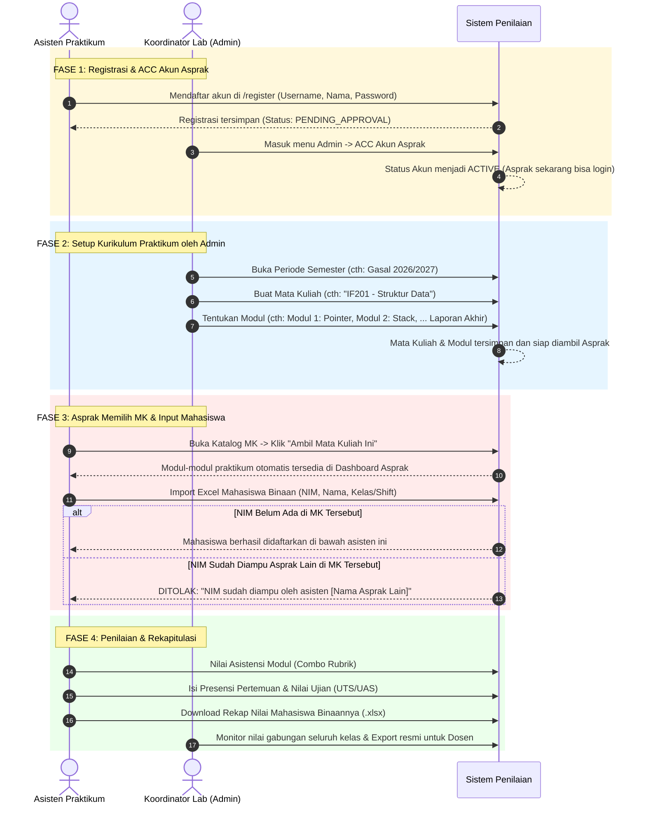

# Product Requirements Document (PRD)
# Sistem Penilaian Asistensi Praktikum Laboratorium

| Metadata | Detail |
| :--- | :--- |
| **Status** | Updated / Ready for Implementation |
| **Versi Dokumen** | **1.2.0 (Admin-Curated Courses & Strict Single-Assistant Enrollment)** |
| **Terakhir Diperbarui** | 2026-09-03 |
| **Stack Utama** | Next.js (App Router), PostgreSQL, Prisma ORM, MinIO (S3-Compatible), Tailwind CSS |
| **Tema Desain** | Neubrutalism (Border 3px hitam solid, offset shadow 4px, font monospaced angka) |

---

## 1. Ringkasan Proyek (Overview & Objective)

Sistem Penilaian Asistensi Laboratorium adalah **platform web internal terpadu** bagi Asisten Praktikum (Asprak) dan Koordinator Laboratorium (Admin) untuk menyelenggarakan, menilai, mengarsipkan tugas, dan merekap nilai praktikum secara cepat dan akurat. Mahasiswa tidak memiliki akses login ke sistem ini.

Pada Versi 1.2.0, alur operasional laboratorium disempurnakan dengan pembagian tanggung jawab yang sangat terstruktur:
1. **Kurikulum Terpusat oleh Admin (Centralized Course & Module Setup):**
   - Koordinator Lab (Admin) membuat Mata Kuliah Praktikum (Kode MK, Nama MK) sekaligus merumuskan modul-modul praktikumnya ($N$ modul beserta penamaannya).
2. **Pemilihan Mata Kuliah Mandiri oleh Asprak (Course Claiming):**
   - Asprak cukup mendaftar (di-ACC Admin), lalu memilih mata kuliah mana saja yang akan diampu pada semester aktif.
   - Seluruh susunan modul yang telah disiapkan Admin otomatis tersedia di ruang kerja Asprak tersebut.
3. **Pendaftaran Praktikan Binaan & Validasi Kepemilikan Tunggal (Strict Single-Assistant Rule):**
   - Asprak mengimpor/menginput mahasiswa praktikan binaannya (misal Kelas A / Shift Senin).
   - **Aturan Integritas:** Dalam satu mata kuliah praktikum yang sama, **seorang mahasiswa (NIM) tidak boleh diampu oleh 2 asisten berbeda**. Jika NIM sudah terdaftar di bawah asprak lain pada mata kuliah tersebut, sistem otomatis menolaknya dengan pesan informatif.
   - Mahasiswa yang sama tetap diperbolehkan mengambil mata kuliah praktikum lain dengan asisten yang berbeda.
4. **Jendela Waktu Input (Windowing & Locking):**
   - Pembatasan periode pembuatan/input mata kuliah oleh Admin (`courseInputStart` s.d. `courseInputEnd`).
   - Pembatasan periode input/import mahasiswa praktikan oleh Asprak (`studentInputStart` s.d. `studentInputEnd`).

---

## 2. Aktor, Peran, & Hak Akses (RBAC)

```
[SISTEM PENILAIAN ASISTENSI]
 ├── 1. Koordinator / Admin Laboratorium (ADMIN)
 │    ├── Mengatur Periode Semester & Jadwal Buka/Tutup Input
 │    ├── Menyetujui / Menolak (ACC) Pendaftaran Akun Asprak
 │    ├── Membuat Mata Kuliah Praktikum, Jumlah Modul, dan Nama-nama Modulnya
 │    ├── Memantau rekapitulasi nilai seluruh mata kuliah & asisten
 │    └── Ekspor nilai resmi semester ke Excel untuk Dosen Pengampu
 └── 2. Asisten Praktikum (ASISTEN)
      ├── Mendaftar akun (berstatus PENDING sampai di-ACC Admin)
      ├── Memilih / Mengambil Mata Kuliah Praktikum yang tersedia untuk diampu
      ├── Mengimpor daftar mahasiswa binaan (hanya selama periode input mahasiswa)
      │    └── Validasi: 1 NIM hanya boleh diampu 1 Asprak dalam 1 MK
      ├── Menilai asistensi modul (Combo Rubrik)
      ├── Mengisi presensi pertemuan, pretest, dan nilai UTS/UAS
      └── Mengunduh rekapitulasi nilai mahasiswa binaannya ke Excel
```

### Matriks Peran & Izin (Access Control Matrix)

| Fitur / Aksi | Asisten Praktikum (ASISTEN) | Koordinator Lab (ADMIN) |
| :--- | :---: | :---: |
| **Registrasi Akun** | Mengajukan (Status `PENDING`) | - |
| **ACC / Aktivasi Akun Asprak** | ❌ Tidak Berhak | ✅ Penuh (ACC / Tolak / Nonaktifkan) |
| **Kelola Periode Akademik (Jadwal)** | 👁️ Melihat Jadwal Aktif | ✅ Penuh (Buka/Tutup Periode) |
| **Buat Mata Kuliah & Rincian Modul** | 👁️ Melihat Daftar MK | ✅ Penuh (Buat MK & Susun Modul) |
| **Pilih / Ambil MK untuk Diampu** | ✅ Memilih dari katalog MK aktif | ✅ Menetapkan asisten ke MK |
| **Import Praktikan (NIM/Nama)** | ✅ Input mahasiswa binaan sendiri | ✅ Penuh (Bisa import ke asisten manapun) |
| **Validasi NIM Ganda per MK** | 🛡️ Ditolak otomatis jika sudah diambil asprak lain | 🛡️ Ditolak otomatis (Integritas Data) |
| **Penilaian Asistensi (Combo)** | ✅ Mahasiswa Binaan Sendiri | ✅ Seluruh Mahasiswa |
| **Input Nilai Ujian (UTS/UAS)** | ✅ Mahasiswa Binaan Sendiri | ✅ Seluruh Mahasiswa |
| **Export Excel Rekap Nilai** | ✅ Format Binaan Sendiri | ✅ Format Lengkap Semua Kelas/Dosen |

---

## 3. Alur Kerja Sistem (Business Workflow)



---

## 4. Aturan Validasi Kepemilikan Mahasiswa (Strict Single-Assistant Rule)

Untuk mencegah tumpang-tindih penilaian dan duplikasi nilai mahasiswa:

1. **Aturan Utama:**
   * Di dalam **satu Mata Kuliah Praktikum yang sama**, seorang mahasiswa (NIM) **hanya boleh dibimbing oleh 1 Asisten Praktikum**.
2. **Pencegahan di Sisi Aplikasi (Server Action):**
   * Saat proses *Import Excel* atau *Tambah Mahasiswa*:
     Sistem memeriksa tabel `CourseEnrollment`:
     ```typescript
     const existingEnrollment = await prisma.courseEnrollment.findUnique({
       where: { courseId_studentNim: { courseId, studentNim } },
       include: { assistant: { select: { name: true } } }
     });

     if (existingEnrollment) {
       if (existingEnrollment.assistantId !== session.userId && session.role !== "ADMIN") {
         // DITOLAK: Laporkan nama asisten yang sudah mengampu
         return {
           success: false,
           message: `Praktikan ${studentNim} sudah terdaftar di mata kuliah ini di bawah bimbingan asisten ${existingEnrollment.assistant?.name}. Mahasiswa tidak boleh diampu oleh 2 asisten berbeda.`
         };
       }
     }
     ```
3. **Garansi Integritas di Sisi Basis Data (Unique Constraint):**
   * Tabel `CourseEnrollment` menerapkan compound unique constraint:
     ```prisma
     @@unique([courseId, studentNim])
     ```
   * Menjamin secara matematis di level database PostgreSQL bahwa tidak akan pernah ada dua baris enrollment untuk NIM dan Course yang sama.
4. **Layanan Lintas Mata Kuliah:**
   * Mahasiswa dengan NIM yang sama **boleh** mengambil mata kuliah praktikum lain dengan asisten yang berbeda (misal: di MK *Struktur Data* dibimbing Asprak A, dan di MK *Basis Data* dibimbing Asprak B).

---

## 5. Struktur Rubrik Penilaian (Tetap Sesuai Formula Resmi)

Masing-masing modul praktikum dinilai menggunakan formula standar laboratorium:

### 5.1. Penilaian Per Modul (100 Poin Maksimal)
* **1. Asistensi Code (55%)**:
  - Kesesuaian Fitur Tugas: **22 poin**
  - Penjelasan & Penguasaan Program: **19 poin**
  - Kehadiran Asistensi: **8 poin**
  - Sikap & Komunikasi: **6 poin**
* **2. Laporan Resmi (35%)**:
  - Pembahasan & Analisis Hasil: **12 poin**
  - Kepatuhan Format Laporan: **10.5 poin**
  - Plagiarisme & Orisinalitas: **9 poin**
  - Kerapian Dokumen: **3.5 poin**
* **3. Ketepatan Pengumpulan (10%)**:
  - Waktu Pengumpulan: **10 poin**

### 5.2. Akumulasi Semester (Rekapitulasi 100%)
$$\text{Nilai Akhir} = (10\% \times \text{Kehadiran 12x}) + (20\% \times \text{Rata-rata Mod } N) + (10\% \times \text{Pretest}) + (25\% \times \text{UTS}) + (35\% \times \text{UAS})$$

Konversi Nilai Akhir menjadi Huruf Mutu resmi:
$$> 80 \rightarrow \mathbf{A} \quad|\quad (75, 80] \rightarrow \mathbf{B+} \quad|\quad (70, 75] \rightarrow \mathbf{B} \quad|\quad (65, 70] \rightarrow \mathbf{C+} \quad|\quad (60, 65] \rightarrow \mathbf{C} \quad|\quad [50, 60] \rightarrow \mathbf{D} \quad|\quad < 50 \rightarrow \mathbf{E}$$

---

## 6. Desain Antarmuka: Neubrutalism

Mengikuti token desain di [design.md](./design.md):
* **Borders & Shadows:** Border solid `3px solid #000000` dengan drop shadow tegas `4px 4px 0 #000000`.
* **Katalog Mata Kuliah untuk Asprak:**
  - Menampilkan kartu-kartu mata kuliah yang dibuat Admin.
  - Jika Asprak sudah mengambil MK tersebut $\rightarrow$ Badge hijau `SEDANG DIAMPU` + tombol `Buka Ruang Kerja`.
  - Jika belum diambil $\rightarrow$ Tombol biru `+ Ambil Mata Kuliah Ini`.
* **Admin Course Builder:**
  - Form pembuatan mata kuliah: Kode MK, Nama MK.
  - Dynamic Form Repeater: Tambah baris modul (Judul Modul, Checkbox Laporan Akhir, Drag/reorder urutan).

---

## 7. Arsitektur Folder Fitur (Feature-First)

```
penilaian_asistensi/
├── app/
│   ├── (auth)/
│   │   ├── login/page.tsx               # Login Asprak & Admin
│   │   └── register/page.tsx            # Registrasi Calon Asprak (Pending Approval)
│   ├── (dashboard)/
│   │   ├── layout.tsx                   # Layout Shell, Navbar, Role Badge
│   │   ├── admin/                       # Panel Khusus Admin Lab
│   │   │   ├── periode/page.tsx         # Kelola Tanggal Buka/Tutup Periode
│   │   │   ├── persetujuan-akun/page.tsx# Antrean ACC Akun Asprak
│   │   │   └── matakuliah/              # Master Kurikulum MK & Modul
│   │   │       ├── page.tsx             # List Seluruh MK & Modul Lab
│   │   │       └── baru/page.tsx        # Builder MK & Modul Dinamis
│   │   ├── praktikum/                   # Halaman Asprak
│   │   │   ├── page.tsx                 # Katalog MK (Pilih MK / Buka MK yang diampu)
│   │   ├── [courseId]/                  # Ruang Kerja Mata Kuliah Terpilih
│   │   │   ├── modul/page.tsx           # Daftar Modul yang sudah disetup Admin
│   │   │   ├── praktikan/page.tsx       # Import & Manajemen Mahasiswa (Validasi 1 Asprak)
│   │   │   ├── penilaian/[modId]/page.tsx # Spreadsheet Penilaian Combo Modul
│   │   │   └── rekap-nilai/page.tsx     # Rekap Semester & Export Excel MK terpilih
├── features/
│   ├── auth/                            # Login, Register, Status Akun
│   ├── admin/                           # ACC Akun Asprak, Kelola Periode
│   ├── courses/                         # Master MK & Modul oleh Admin, Klaim MK oleh Asprak
│   ├── students/                        # Import Mahasiswa dengan Validasi Single-Assistant per MK
│   ├── grading/                         # Combo Rubric Evaluation Workspace
│   └── final-grades/                    # Formula Semester & Export Excel .xlsx
```

---

## 8. Rancangan Skema Basis Data Relasional (Prisma ORM)

```prisma
datasource db {
  provider = "postgresql"
}

generator client {
  provider = "prisma-client-js"
}

enum Role {
  ADMIN
  ASISTEN
}

enum UserStatus {
  PENDING_APPROVAL   // Baru mendaftar, menunggu persetujuan Admin
  ACTIVE             // Disetujui, dapat login dan beraktivitas
  REJECTED           // Ditolak oleh Admin
  SUSPENDED          // Dinonaktifkan sementara
}

enum SubmissionStatus {
  NOT_SUBMITTED
  SUBMITTED
  GRADED
}

enum FileType {
  PDF
  VIDEO
  IMAGE
  ARCHIVE
}

// 1. Periode Akademik / Semester
model AcademicPeriod {
  id                String     @id @default(uuid())
  name              String     // Contoh: "Semester Gasal 2026/2027"
  isActive          Boolean    @default(false)

  // Jendela Waktu Pembuatan / Input Mata Kuliah oleh Admin
  courseInputStart  DateTime   @default(now())
  courseInputEnd    DateTime   @default(now())

  // Jendela Waktu Input / Import Mahasiswa oleh Asprak
  studentInputStart DateTime
  studentInputEnd   DateTime

  createdAt         DateTime   @default(now())
  updatedAt         DateTime   @default(now()) @updatedAt

  courses           Course[]
}

// 2. Akun Pengguna (Asprak & Admin)
model User {
  id               String       @id @default(uuid())
  username         String       @unique // Kode Asprak / NIP
  name             String
  email            String?      @unique
  passwordHash     String
  role             Role         @default(ASISTEN)
  status           UserStatus   @default(PENDING_APPROVAL) // Wajib di-ACC Admin
  approvedAt       DateTime?
  approvedById     String?

  createdAt        DateTime     @default(now())
  updatedAt        DateTime     @default(now()) @updatedAt

  // Relasi
  createdCourses   Course[]     @relation("CourseAdminCreator")
  assignedCourses  CourseAssistant[]
  gradedItems      Grade[]      @relation("AssistantGrades")
  studentEnrollments CourseEnrollment[] @relation("AssistantEnrollments")
}

// 3. Mata Kuliah Praktikum (Dibuat oleh Admin)
model Course {
  id                String          @id @default(uuid())
  academicPeriodId  String
  code              String          // Contoh: "IF201"
  title             String          // Contoh: "Struktur Data"
  description       String?
  creatorId         String          // Admin pembuat

  createdAt         DateTime        @default(now())
  updatedAt         DateTime        @default(now()) @updatedAt

  academicPeriod    AcademicPeriod  @relation(fields: [academicPeriodId], references: [id], onDelete: Cascade)
  creator           User            @relation("CourseAdminCreator", fields: [creatorId], references: [id])
  assistants        CourseAssistant[]
  modules           Module[]
  enrollments       CourseEnrollment[]
  pretests          Pretest[]
  attendances       Attendance[]
  finalGrades       FinalGrade[]
}

// Relasi Asprak yang mengampu Mata Kuliah Praktikum
model CourseAssistant {
  id          String   @id @default(uuid())
  courseId    String
  assistantId String
  assignedAt  DateTime @default(now())

  course      Course   @relation(fields: [courseId], references: [id], onDelete: Cascade)
  assistant   User     @relation(fields: [assistantId], references: [id], onDelete: Cascade)

  @@unique([courseId, assistantId])
}

// 4. Modul Dinamis per Mata Kuliah (Disusun oleh Admin)
model Module {
  id            String       @id @default(uuid())
  courseId      String
  title         String       // Contoh: "Modul 1: Pointer & Struct"
  orderIndex    Int          // Urutan modul (1, 2, 3...)
  description   String?
  deadline      DateTime?
  isFinalReport Boolean      @default(false) // Apakah modul ini adalah Laporan Akhir
  createdAt     DateTime     @default(now())
  updatedAt     DateTime     @default(now()) @updatedAt

  course        Course       @relation(fields: [courseId], references: [id], onDelete: Cascade)
  submissions   Submission[]

  @@unique([courseId, orderIndex])
}

// 5. Data Mahasiswa (Identitas Global)
model Student {
  nim          String       @id // Primary Key: NIM Mahasiswa
  name         String       // Nama Lengkap
  createdAt    DateTime     @default(now())
  updatedAt    DateTime     @default(now()) @updatedAt

  enrollments  CourseEnrollment[]
  submissions  Submission[]
  attendances  Attendance[]
  pretestScores PretestScore[]
  finalGrades  FinalGrade[]
}

// 6. Pendaftaran Mahasiswa per MK (Strict Single-Assistant Rule)
model CourseEnrollment {
  id           String       @id @default(uuid())
  courseId     String
  studentNim   String
  assistantId  String       // Asprak tunggal yang membina mahasiswa ini di MK ini
  classGroup   String?      // Contoh: "Kelas B / Shift 1"
  enrolledAt   DateTime     @default(now())

  course       Course       @relation(fields: [courseId], references: [id], onDelete: Cascade)
  student      Student      @relation(fields: [studentNim], references: [nim], onDelete: Cascade)
  assistant    User         @relation("AssistantEnrollments", fields: [assistantId], references: [id], onDelete: Restrict)

  // 1 NIM hanya boleh ada 1 kali per Course (Tidak boleh diampu 2 asprak di MK yang sama)
  @@unique([courseId, studentNim])
}

// 7. Data Tugas/Asistensi per Modul
model Submission {
  id           String           @id @default(uuid())
  studentNim   String
  moduleId     String
  githubUrl    String?
  demoUrl      String?
  submittedAt  DateTime         @default(now())
  status       SubmissionStatus @default(SUBMITTED)

  student      Student          @relation(fields: [studentNim], references: [nim], onDelete: Cascade)
  module       Module           @relation(fields: [moduleId], references: [id], onDelete: Cascade)
  files        SubmissionFile[]
  grade        Grade?

  @@unique([studentNim, moduleId])
}

model SubmissionFile {
  id           String     @id @default(uuid())
  submissionId String
  fileName     String
  fileKey      String
  fileUrl      String
  fileType     FileType
  fileSizeBytes Int
  createdAt    DateTime   @default(now())

  submission   Submission @relation(fields: [submissionId], references: [id], onDelete: Cascade)
}

// 8. Lembar Penilaian Asistensi
model Grade {
  id                    String     @id @default(uuid())
  submissionId          String     @unique
  assistantId           String
  asistensiDate         DateTime   @default(now())

  // Asistensi Code (55%)
  taskConformity        Float      @default(0) // Max 22
  programExplanation    Float      @default(0) // Max 19
  attendance            Float      @default(0) // Max 8
  attitude              Float      @default(0) // Max 6

  // Laporan Resmi (35%)
  reportDiscussion      Float      @default(0) // Max 12
  reportFormat          Float      @default(0) // Max 10.5
  plagiarism            Float      @default(0) // Max 9
  neatness              Float      @default(0) // Max 3.5

  // Pengumpulan (10%)
  submissionPunctuality Float      @default(0) // Max 10

  totalScore            Float      @default(0) // Max 100
  notes                 String?

  createdAt             DateTime   @default(now())
  updatedAt             DateTime   @default(now()) @updatedAt

  submission            Submission @relation(fields: [submissionId], references: [id], onDelete: Cascade)
  assistant             User       @relation("AssistantGrades", fields: [assistantId], references: [id])
}

// 9. Presensi Pertemuan per Mata Kuliah
model Attendance {
  id           String     @id @default(uuid())
  courseId     String
  studentNim   String
  meetingNo    Int        // 1 s.d. 12
  score        Float      @default(100)
  createdAt    DateTime   @default(now())

  course       Course     @relation(fields: [courseId], references: [id], onDelete: Cascade)
  student      Student    @relation(fields: [studentNim], references: [nim], onDelete: Cascade)

  @@unique([courseId, studentNim, meetingNo])
}

// 10. Pretest per Mata Kuliah
model Pretest {
  id          String         @id @default(uuid())
  courseId    String
  title       String         // Contoh: "Pretest Modul 1-3"
  orderIndex  Int

  course      Course         @relation(fields: [courseId], references: [id], onDelete: Cascade)
  scores      PretestScore[]

  @@unique([courseId, orderIndex])
}

model PretestScore {
  id          String   @id @default(uuid())
  pretestId   String
  studentNim  String
  score       Float    @default(0)

  student     Student  @relation(fields: [studentNim], references: [nim], onDelete: Cascade)
  pretest     Pretest  @relation(fields: [pretestId], references: [id], onDelete: Cascade)

  @@unique([pretestId, studentNim])
}

// 11. Rekap Nilai Akhir Semester per Mata Kuliah
model FinalGrade {
  id           String     @id @default(uuid())
  courseId     String
  studentNim   String
  utsScore     Float      @default(0) // Nilai Murni UTS (0 - 100)
  uasScore     Float      @default(0) // Nilai Murni UAS (0 - 100)
  createdAt    DateTime   @default(now())
  updatedAt    DateTime   @default(now()) @updatedAt

  course       Course     @relation(fields: [courseId], references: [id], onDelete: Cascade)
  student      Student    @relation(fields: [studentNim], references: [nim], onDelete: Cascade)

  @@unique([courseId, studentNim])
}
```

---

## 9. Rencana Implementasi

1. **Sinkronisasi Skema Database (v1.2.0)**
   - Perbarui `prisma/schema.prisma` dan lakukan `npx prisma db push --force-reset` + `npx prisma generate`.
2. **Setup Kurikulum & Periode oleh Admin**
   - Admin Panel: Buat Mata Kuliah Praktikum beserta Modul 1..$N$.
   - Admin Panel: Set tanggal buka/tutup periode input mahasiswa.
   - Admin Panel: ACC akun asisten yang mendaftar.
3. **Katalog Praktikum & Klaim MK oleh Asprak**
   - Halaman `/praktikum` bagi Asprak untuk melihat dan mengambil mata kuliah yang dibuka Admin.
   - Dashboard ruang kerja scoped per mata kuliah (`/[courseId]/...`).
4. **Import Mahasiswa dengan Validasi Single-Assistant per MK**
   - Import Excel mahasiswa yang otomatis memeriksa apakah NIM sudah diampu oleh asisten lain di MK tersebut. Jika sudah, tampilkan peringatan nama asisten yang mengampu dan lewati baris tersebut.
